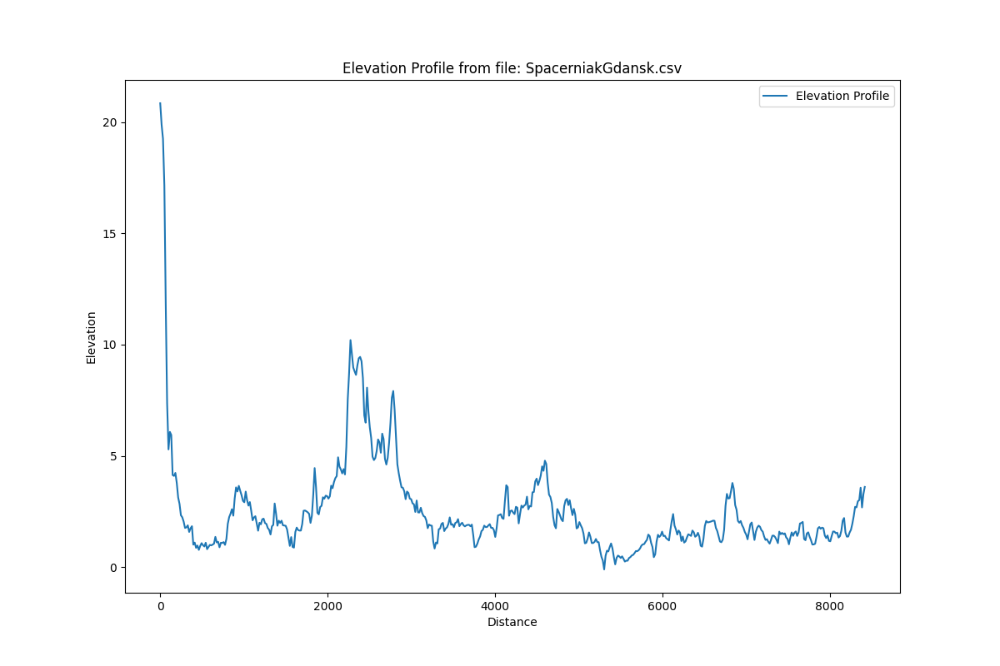
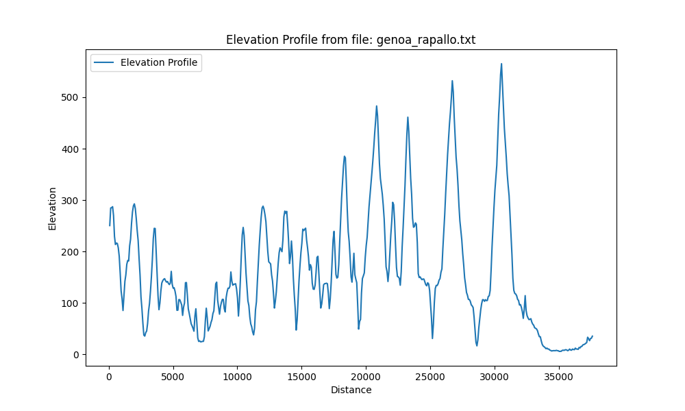

# Badanie interpolacji funkcji
### Marta Kociszewska 198143

---
# 1. Wstęp

W niniejszym raporcie przedstawiono analizę metod interpolacji funkcji, ze szczególnym uwzględnieniem wielomianu interpolacyjnego Lagrange’a oraz funkcji sklejanych trzeciego stopnia.
Celem analizy jest zbadanie przydatności obu metod w kontekście aproksymacji funkcji na podstawie danych rzeczywistych, a także ocena wpływu różnych parametrów na wyniki interpolacji.

Interpolacja jest procesem szacowania wartości funkcji w punktach, które nie są bezpośrednio znane, na podstawie wartości funkcji w innych punktach (węzłach interpolacyjnych).
W kontekście analizy danych rzeczywistych interpolacja jest szczególnie przydatna do wygładzania danych, uzupełniania brakujących wartości oraz analizy trendów.

## 1.1 Interpolacja
Zadaniem interpolacji jest wyznaczenie przybliżonych wartości funkcji w punktach niebędących węzłami interpolacyjnymi 
oraz oszacowanie błędu tych przybliżonych wartości funkcji. W tym celu należy znaleźć funkcję interpolującą $F(x)$, 
która w węzłach interpolacyjnych przyjmuje takie same wartości co funkcja f(x).

## 1.2 Interpolacja wielomianowa
Interpolacja wielomianowa polega na znalezieniu wielomianu $W_n(x)$, który przechodzi przez zadane punkty (węzły interpolacyjne).

## 1.3 Wielomian interpolacyjny Lagrange’a:

Wielomian interpolacyjny Lagrange’a jest jedną z metod interpolacji, która pozwala na znalezienie wielomianu przechodzącego przez zadane punkty (węzły interpolacyjne). 
Jest to metoda szczególnie przydatna, gdy mamy do czynienia z małą liczbą punktów i chcemy uzyskać dokładne odwzorowanie funkcji w tych punktach.

Interpolacja z wykorzystaniem wzoru Lagrange’a zakłada dowolne rozmieszczenie węzłów interpolacyjnych. 
Wartość wielomianu interpolacyjnego można uzyskać bez czasochłonnego rozwiązywania układu równań dla współczynników.
W tym celu stosuje się wzór interpolacyjny Lagrange’a: 
$$
W_n(x) = \sum_{i=0}^{n} y_i \frac{\omega_n(x)}{(x-x_j)*\omega'_n(x)}
$$
gdzie:
 - $\omega_n(x) = (x-x_0)(x-x_1)...(x-x_n)$
 - $\omega'_n(x)$ to wartość pochodnej w punkcie $x_j$.

Wzór ten pozwala na obliczenie wartości wielomianu interpolacyjnego w dowolnym punkcie $x$ na podstawie wartości funkcji w węzłach interpolacyjnych $y_i$.

Wartość **błędu bezwzględnego** interpolacji funkcji $f(x)$ w punktach z przedziału $[a,b]$ nie będących węzłami interpolacyjnymi można oszacować za pomocą wzoru:
$$
R_n(x) = |f(x) - W_n(x)| \leq \frac{M_{n+1}}{(n+1)!} |\omega_n(x)|
$$

gdzie:
 - $M_{n+1}$ to największa wartość $|f^{(n+1)}(x)|$ w przedziale $[a,b]$,
 - $\omega_n(x)$ to iloczyn $(x-x_0)(x-x_1)...(x-x_n)$.

## 1.3 Interpolacja funkcji sklejanych trzeciego stopnia

Interpolacja funkcji sklejanych trzeciego stopnia jest metodą, która pozwala na uzyskanie gładkiej funkcji interpolującej.
Polega na podziale przedziału na mniejsze odcinki i dopasowaniu do każdego z nich wielomianu trzeciego stopnia, 
który jest ciągły i ma ciągłe pochodne pierwszego i drugiego rzędu w punktach węzłów interpolacyjnych.

Wielominay sklejane trzeciego stopnia mają postać:
$$
W_i(x) = a_i + b_i (x - x_i) + c_i (x - x_i)^2 + d_i (x - x_i)^3, \quad i = 0, 1, \ldots, n-1
$$

Metoda funkcji sklejanych pozwala na wyznaczenie współczynników $a_i$, $b_i$, $c_i$, $d_i$ dla każdego odcinka.

## 1.4 Wybór węzłów interpolacyjnych
Wybór węzłów interpolacyjnych jest kluczowym elementem procesu interpolacji. Węzły powinny być rozmieszczone w taki sposób, aby zapewnić jak najlepsze odwzorowanie funkcji w danym przedziale.
Przeanalizowano różne metody wyboru węzłów interpolacyjnych, takie jak:

- **Równomierne rozmieszczenie**: Węzły są rozmieszczone równomiernie w przedziale, co jest najprostszą metodą, 
ale może prowadzić do problemów z błędem interpolacji, zwłaszcza w przypadku funkcji o dużych wartościach pochodnych.

- **Rozmieszczenie Chebysheva**: Węzły są rozmieszczone w taki sposób, aby zminimalizować błąd interpolacji. Jest to 
szczególnie przydatne w przypadku funkcji o dużych wartościach pochodnych.
    Zaimplementowano węzły Chebysheva pierwszego rodzaju, które są rozmieszczone w przedziale $[-1, 1]$ i mają postać:
    $$
    x_k = \cos\left(\frac{(2k + 1) \pi}{2n}\right), \quad k = 0, 1, \ldots, n-1
    $$

## 1.5 Zapewnienie stabilności numerycznej

W celu zapewnienia stabilności numerycznej podczas interpolacji, szczególnie w przypadku wielomianu Lagrange’a,
przekształcono dziedzinę funkcji interpolowanej do przedziału:
$$[-1, 1]$$

# 2. Analiza

## 2.1 Dane wejściowe

Analiza interpolacji funkcji została przeprowadzona na podstawie danych, dla różnych rodzajów tras, takich jak:

**Trasa 1 - spacerniak w Gdańsku**: 

Trasa prawie płaska, z niewielkimi wzniesieniami i spadkami.

\newpage

**Trasa 2 - Mount Everest**: 

Trasa o jednym wyraźnym wzniesieniu.

**Trasa 3 - Genoa Rapallo**: 

Trasa różnorodna, z wieloma wzniesieniami i spadkami.

# 3. Interpolacja wielomianowa Lagrange’a

Dla każdego zbioru danych przeprowadzono interpolację wielomianową Lagrange’a, analizując wpływ liczby węzłów interpolacyjnych oraz ich rozmieszczenie na dokładność interpolacji.

Wyniki interpolacji przedstawiono na wykresach, gdzie porównano wartości funkcji interpolowanej z rzeczywistymi wartościami funkcji w punktach węzłów interpolacyjnych.

## 3.1 Analiza wpływu dystrybucji węzłów interpolacyjnych
Analiza została przeprowadzona dla dwóch rodzajów rozmieszczenia węzłów interpolacyjnych: **równomiernego**, **Chebysheva**.
Celem było zbadanie, jak rozmieszczenie węzłów wpływa na dokładność interpolacji.

Wyniki interpolacji dla różnych rozmieszczeń węzłów interpolacyjnych przedstawiono na wykresach, gdzie porównano wartości funkcji interpolowanej z rzeczywistymi wartościami funkcji w punktach węzłów interpolacyjnych.

### Trasa 1

| Rozmieszczenie równomierne                                                                                                                        | Rozmieszczenie Chebysheva                                                                                                                          |
|---------------------------------------------------------------------------------------------------------------------------------------------------|----------------------------------------------------------------------------------------------------------------------------------------------------|
|  |  | |   
|  |  |

Węzły rozmieszczone równomiernie:

Krzywa interpolacyjna wykazuje bardzo silne oscylacje na krańcach przedziału (początek i koniec), z wartościami znacznie odbiegającymi od rzeczywistych.
Dodatkowo, silne oscylacje pojawiają się również w innych miejscach trasy, zwłaszcza tam, gdzie występują gwałtowne zmiany wysokości.

Węzły Chebysheva:

Krzywa interpolacyjna dość dobrze podąża za ogólnym kształtem trasy. Początkowy stromy spadek jest uchwycony poprawnie.
Mimo że interpolacja nie oddaje wszystkich drobnych detali, zwłaszcza na płaskim odcinku, nie występują ekstremalne oscylacje, a krzywa jest stabilna.

### Trasa 2

| Rozmieszczenie równomierne                                                                                                                | Rozmieszczenie Chebysheva                                                                                                                  |
|-------------------------------------------------------------------------------------------------------------------------------------------|--------------------------------------------------------------------------------------------------------------------------------------------|
|  |  |
|  |  |

Węzły rozmieszczone równomiernie:

Mimo że profil jest gładki, nadal widoczne są znaczące oscylacje na krańcach przedziału (początek i koniec trasy). Krzywa interpolacyjna przyjmuje wartości znacznie odbiegające od prawdziwych danych w tych obszarach.
W środkowej części trasy, gdzie funkcja jest bardziej liniowa, dopasowanie jest dobre, ale problem oscylacji na brzegach jest wyraźny.

Węzły Chebysheva:

Krzywa interpolacyjna bardzo dokładnie odwzorowuje profil wysokości. Jest gładka i niemal idealnie pokrywa się z prawdziwymi danymi na całej długości trasy.

### Trasa 3

| Rozmieszczenie równomierne                                                                                                                 | Rozmieszczenie Chebysheva                                                                                                                   |
|--------------------------------------------------------------------------------------------------------------------------------------------|---------------------------------------------------------------------------------------------------------------------------------------------|
|  |  |
|  |  |

Węzły rozmieszczone równomiernie:

Krzywa interpolacyjna wykazuje ekstremalne oscylacje (zjawisko Rungego), zwłaszcza na krańcach przedziału (początek i koniec trasy) 
oraz w obszarach o dużej zmienności (np. około 30000 jednostek odległości). Wartości interpolacji znacznie wykraczają poza 
zakres wartości prawdziwych danych (np. spadki do -400 i wzrosty powyżej 1000).
Mimo że w niektórych miejscach interpolacja jest bliska prawdziwym danym, ogólna jakość jest bardzo niska z powodu silnych oscylacji.

Węzły Chebysheva:

Krzywa interpolacyjna (czerwona przerywana linia) jest stosunkowo gładka i podąża za ogólnym trendem prawdziwych danych.
Odchylenia od prawdziwych danych są zauważalne, zwłaszcza w obszarach gwałtownych zmian wysokości, ale interpolacja pozostaje 
w rozsądnych granicach wartości prawdziwych danych. Nie widać ekstremalnych oscylacji.

### Wnioski z analizy rozmieszczenia węzłów interpolacyjnych

Analiza wykazała, że rozmieszczenie węzłów interpolacyjnych ma istotny wpływ na dokładność interpolacji.
W przypadku rozmieszczenia równomiernego, interpolacja może prowadzić do dużych błędów, zwłaszcza w obszarach o dużych wartościach pochodnych funkcji.
Z kolei rozmieszczenie Chebysheva pozwala na uzyskanie znacznie lepszych wyników, minimalizując błąd interpolacji.

Występuje _efekt Rungego_, który polega na tym, że w przypadku rozmieszczenia równomiernego, błąd interpolacji rośnie wraz ze wzrostem liczby węzłów interpolacyjnych. 
Na krańcach przedziału występują duże oscylacje, co prowadzi do znacznych błędów. 
Rozmieszczenie Chebysheva pozwala na zminimalizowanie tego efektu, co jest szczególnie widoczne w przypadku funkcji o dużych wartościach pochodnych.

## 3.2 Analiza wpływu liczby węzłów interpolacyjnych

Analiza została przeprowadzona dla różnych liczby węzłów interpolacyjnych - **10, 20, 40, 60, 80, 100**, w celu oceny wpływu liczby węzłów na dokładność interpolacji.
Aby uzyskać lepsze wyniki, węzły interpolacyjne zostały rozmieszczone zgodnie z rozkładem Chebysheva. Dzięki temu możliwe było zminimalizowanie błędu interpolacji, 
zwłaszcza w obszarach o dużych wartościach pochodnych funkcji oraz uniknięcie _efektu Rungego_.

Wyniki interpolacji dla różnych liczby węzłów interpolacyjnych przedstawiono na wykresach, gdzie porównano wartości funkcji 
interpolowanej z rzeczywistymi wartościami funkcji w punktach węzłów interpolacyjnych.

### Trasa 1 - spacerniak w Gdańsku

|                                                                               |                                                                                 |
|-------------------------------------------------------------------------------|---------------------------------------------------------------------------------|
|  |    |
|  |    |
|  |  |

**Wpływ liczby węzłów interpolacyjnych:**

- Mała liczba węzłów (np. 10 węzłów):

Interpolacja jest znacznie wygładzona i słabo odwzorowuje szczegóły oraz lokalne wahania danych rzeczywistych.
Występuje znaczne odchylenie między krzywą interpolowaną a danymi rzeczywistymi, szczególnie w obszarach o większej zmienności (np. początek i okolice 2500 jednostek odległości).
Generalny kształt danych jest uchwycony, ale brakuje precyzji.

- Zwiększenie liczby węzłów (np. 20, 40, 60 węzłów):

Wraz ze wzrostem liczby węzłów, krzywa interpolacji Lagrange'a staje się coraz dokładniejsza i lepiej dopasowuje się do danych rzeczywistych.
Lokalne szczyty i doliny są lepiej odwzorowywane, a ogólne odchylenie od danych rzeczywistych maleje.
Interpolacja jest bardziej elastyczna i potrafi uchwycić więcej szczegółów w przebiegu danych.

- Duża liczba węzłów (np. 80, 100 węzłów):

Dopasowanie w środkowej części zakresu danych staje się bardzo dobre, a krzywa interpolacji niemal pokrywa się z danymi rzeczywistymi.
Jednakże, pojawia się zjawisko Rungego na krańcach przedziału interpolacji. Widać to wyraźnie na wykresach dla 80 i 100 węzłów, gdzie na początku (okolice 0) i na końcu (okolice 8000-8500 jednostek odległości) krzywa interpolacji zaczyna gwałtownie oscylować i znacznie odbiegać od danych rzeczywistych, przyjmując wartości znacznie większe lub mniejsze niż rzeczywiste. Jest to typowy problem interpolacji wielomianowej wysokiego stopnia, szczególnie gdy węzły są równoodległe (choć tutaj użyto węzłów Chebysheva, które zazwyczaj redukują to zjawisko, przy bardzo dużej liczbie węzłów nadal może być widoczne).
W praktyce oznacza to, że zbyt duża liczba węzłów może prowadzić do overfittingu i niestabilności interpolacji na granicach zakresu danych, co sprawia, że interpolacja staje się niewiarygodna w tych obszarach.

Podsumowując:

Istnieje optymalna liczba węzłów dla interpolacji Lagrange'a. Zbyt mała liczba węzłów prowadzi do niedostatecznego dopasowania (underfitting), podczas gdy zbyt duża liczba węzłów może prowadzić do niestabilności i dużych błędów na krańcach przedziału (zjawisko Rungego, overfitting). W przypadku tych danych, wydaje się, że około 40-60 węzłów Chebysheva zapewnia dobrą równowagę między dokładnością dopasowania a unikaniem problemów na granicach.

### Trasa 2 - Mount Everest

|                                                                           |                                                                             |
|---------------------------------------------------------------------------|-----------------------------------------------------------------------------|
|  |    |
|  |    |
|  |  |

**Wpływ liczby węzłów interpolacyjnych:**

- Mała liczba węzłów (np. 10 węzłów):

Krzywa interpolacji (czerwona, przerywana linia) dobrze oddaje ogólny trend danych rzeczywistych (niebieska, ciągła linia).
Jednakże, pomimo że węzły są rozmieszczone strategicznie (Chebyshev), interpolacja jest zbyt "gładka" i nie uchwytuje mniejszych, lokalnych fluktuacji i szczegółów danych rzeczywistych. Widać to szczególnie w okolicach szczytu (ok. 2500-3000 jednostek odległości) oraz na bardziej płaskich odcinkach.
Odchylenia od danych rzeczywistych są zauważalne, ale nie ma tu jeszcze drastycznych oscylacji.

- Zwiększenie liczby węzłów (np. 20, 40, 60 węzłów):

Wraz ze wzrostem liczby węzłów, interpolacja staje się coraz dokładniejsza. Krzywa interpolacji zaczyna coraz wierniej odwzorowywać dane rzeczywiste, przylegając do nich coraz bliżej.
Lokalne wahania i drobne nieregularności danych rzeczywistych są coraz lepiej odwzorowywane przez interpolowaną krzywą.
Węzły interpolacyjne (zielone kropki) są gęściej rozmieszczone, co pozwala na lepsze "uchwycenie" kształtu funkcji.
Dla 40 i 60 węzłów, dopasowanie wydaje się być bardzo dobre na większości przebiegu trasy, bez widocznych oznak niestabilności.

- Duża liczba węzłów (np. 80, 100 węzłów):

W przypadku 80 węzłów, widać wyraźne zjawisko Rungego na krańcach przedziału interpolacji. Na początku (okolice 0) i na końcu (okolice 7500-8000 jednostek odległości) interpolowana krzywa zaczyna gwałtownie oscylować, wykazując duże, nierealistyczne wartości, znacznie odbiegające od danych rzeczywistych. Mimo że w środkowej części zakresu dopasowanie jest nadal bardzo dobre, te ekstremalne oscylacje sprawiają, że interpolacja jest niewiarygodna w obszarach brzegowych.
Dla 100 węzłów, zjawisko Rungego jest jeszcze bardziej intensywne na krańcach, z jeszcze większymi amplitudami oscylacji. Pomimo doskonałego dopasowania w środku, problem na brzegach staje się dominujący.

Podsumowując:

Podobnie jak w poprzednim przypadku, wybór odpowiedniej liczby węzłów jest kluczowy.
Zbyt mała liczba węzłów prowadzi do zbytniego wygładzenia i utraty detali.
Optymalna liczba węzłów (prawdopodobnie w zakresie 40-60 dla tych danych) pozwala na wierne odwzorowanie kształtu danych bez nadmiernych oscylacji.
Zbyt duża liczba węzłów, mimo że teoretycznie zwiększa stopień dopasowania, w praktyce prowadzi do problemu stabilności na granicach (zjawisko Rungego), co czyni interpolację nieużyteczną w tych obszarach. Węzły Chebysheva minimalizują to zjawisko w porównaniu do równoodległych węzłów, ale przy wystarczająco dużej liczbie węzłów problem nadal się pojawia.

### Trasa 3 - Genoa Rapallo

|                                                                            |                                                                              |
|----------------------------------------------------------------------------|------------------------------------------------------------------------------|
|  |    |
|  |    |
|  |  |

**Wpływ liczby węzłów interpolacyjnych:**

- Mała liczba węzłów (np. 10 węzłów):

Interpolowana krzywa (czerwona, przerywana linia) jest bardzo wygładzona i stanowi jedynie bardzo ogólne przybliżenie danych rzeczywistych (niebieska, ciągła linia).
Lokalne, szybkie wahania wysokości w danych rzeczywistych (liczne "szczyty" i "doliny") są całkowicie pominięte lub znacznie złagodzone przez interpolację.
Odchylenia od danych rzeczywistych są znaczne. Interpolacja nie jest w stanie uchwycić złożoności terenu.

- Zwiększenie liczby węzłów (np. 20, 30, 40, 60 węzłów):

Wraz ze wzrostem liczby węzłów, interpolacja stopniowo staje się dokładniejsza. Krzywa interpolacji zaczyna coraz lepiej odwzorowywać lokalne szczyty i doliny danych rzeczywistych.
Dla 20 węzłów poprawa jest widoczna, ale nadal wiele detali jest pomijanych.
Przy 30 i 40 węzłach, interpolacja znacząco lepiej dopasowuje się do danych, odzwierciedlając coraz więcej nieregularności terenu.
Dla 60 węzłów, dopasowanie jest już bardzo dobre w większości przedziału. Krzywa interpolacji podąża bardzo blisko za danymi rzeczywistymi, uchwytując wiele z ich zmienności. Węzły interpolacji (zielone kropki) są rozmieszczone coraz gęściej, co naturalnie poprawia lokalne dopasowanie.

- Duża liczba węzłów (np. 80, 100 węzłów):

W przypadku 80 węzłów, pomimo bardzo dobrego dopasowania w środkowej części zakresu, na krańcach przedziału interpolacji (początek i koniec trasy) obserwujemy bardzo silne zjawisko Rungego. Krzywa interpolacji zaczyna gwałtownie oscylować z dużymi amplitudami, wykraczając daleko poza zakres wartości danych rzeczywistych.
Dla 100 węzłów, zjawisko Rungego jest jeszcze bardziej dramatyczne i rozciąga się na większą część przedziału, szczególnie na obu końcach. Oscylacje są ekstremalne, co sprawia, że interpolacja jest całkowicie bezużyteczna do reprezentowania danych w tych obszarach.

Podsumowując:

Dane dla trasy "genoa_rapallo.txt" charakteryzują się dużą zmiennością i licznymi lokalnymi szczytami i dolinami, co czyni je wymagającymi dla interpolacji wielomianowej.
Niewystarczająca liczba węzłów (np. 10): Prowadzi do zbyt dużego wygładzenia i utraty kluczowych informacji o profilu terenu.
Optymalna liczba węzłów (ok. 60): Pozwala na bardzo dobre dopasowanie do danych rzeczywistych, efektywnie uchwytując ich złożoność, bez widocznych oznak niestabilności. Dla tego typu danych, gdzie przebieg jest bardzo nieregularny, większa liczba węzłów jest potrzebna do osiągnięcia akceptowalnej dokładności.
Zbyt duża liczba węzłów (np. 80, 100): Powoduje poważne problemy ze stabilnością interpolacji na krańcach przedziału (zjawisko Rungego). Mimo że węzły Chebysheva pomagają w rozłożeniu błędu, przy tak nieregularnych danych i dużej liczbie węzłów, problem ten staje się dominujący, uniemożliwiając wiarygodne prognozowanie lub reprezentowanie danych w tych obszarach.
Podsumowując, dla danych o wysokiej zmienności, znalezienie idealnej liczby węzłów jest kluczowe. Interpolacja Lagrange'a z węzłami Chebysheva jest skuteczna, ale ma swoje ograniczenia, zwłaszcza gdy dąży się do zbyt dużej dokładności poprzez zwiększanie stopnia wielomianu, co skutkuje niestabilnością na brzegach.

### Wnioski z analizy ilości węzłów interpolacyjnych

**Wpływ liczby węzłów:**

- Zwiększanie liczby węzłów interpolacyjnych zazwyczaj prowadzi do zwiększenia dokładności aproksymacji danych. Im więcej punktów jest użytych do konstrukcji wielomianu interpolacyjnego, tym lepiej jest on w stanie uchwycić szczegóły i fluktuacje oryginalnej funkcji.

- Istnieje punkt nasycenia. Powyżej pewnej liczby węzłów, dalsze ich dodawanie może nie przynosić już widocznej poprawy dokładności, szczególnie jeśli funkcja jest gładka. W niektórych przypadkach (niezaobserwowanych tutaj, ale teoretycznie możliwych przy bardzo dużej liczbie węzłów i niewłaściwym ich rozmieszczeniu, np. równoodległych), może nawet prowadzić do zjawiska Rungego, czyli oscylacji na brzegach przedziału. Użycie węzłów Czebyszewa minimalizuje to ryzyko.

**Wpływ rodzaju trasy (charakterystyki danych):**

- Trasy o wysokiej nieregularności i dużej liczbie ostrych zmian (np. "genoa_rapallo.txt") wymagają znacznie większej liczby węzłów interpolacyjnych, aby uzyskać akceptowalną dokładność. W przypadku takich danych, nawet duża liczba węzłów może nie oddać idealnie wszystkich detali, ale znacznie poprawia ogólne dopasowanie. Wygładzanie jest znaczące przy małej liczbie węzłów.

- Trasy o gładkim i regularnym profilu (np. "MountEverest.csv") mogą być bardzo dobrze aproksymowane za pomocą stosunkowo niewielkiej liczby węzłów. Charakterystyka danych, a konkretnie ich "gładkość" i stopień złożoności, ma fundamentalne znaczenie dla efektywności interpolacji. Im bardziej "gładka" funkcja, tym mniej węzłów potrzeba do jej dokładnego odwzorowania.

Podsumowując, optymalna liczba węzłów interpolacyjnych jest silnie zależna od charakterystyki danych, które mają być interpolowane. Dla bardzo nieregularnych danych, konieczne jest użycie większej liczby węzłów, podczas gdy dla gładkich danych mniejsza liczba węzłów jest często wystarczająca. Węzły Czebyszewa są dobrym wyborem, ponieważ minimalizują oscylacje, co jest szczególnie ważne przy interpolacji danych o dużej zmienności.

# 4. Interpolacja funkcji sklejanych trzeciego stopnia

## 4.1 Analiza wpływu dystrybucji węzłów interpolacyjnych

Analiza została przeprowadzona dla dwóch rodzajów rozmieszczenia węzłów interpolacyjnych: **równomiernego**, **Chebysheva**. Celem było zbadanie, jak rozmieszczenie węzłów wpływa na dokładność interpolacji.

Wyniki interpolacji dla różnych rozmieszczeń węzłów interpolacyjnych przedstawiono na wykresach, gdzie porównano wartości funkcji interpolowanej z rzeczywistymi wartościami funkcji w punktach węzłów interpolacyjnych.

### Trasa 1 

| Rozmieszczenie równomierne                                                                                                                                     | Rozmieszczenie Chebysheva                                                                                                                                        |
|----------------------------------------------------------------------------------------------------------------------------------------------------------------|------------------------------------------------------------------------------------------------------------------------------------------------------------------|
|  |  |
|  |   |

### Trasa 2

| Rozmieszczenie równomierne                                                                                                                             | Rozmieszczenie Chebysheva                                                                                                                               |
|--------------------------------------------------------------------------------------------------------------------------------------------------------|---------------------------------------------------------------------------------------------------------------------------------------------------------|
|  |  |
|  |  |

### Trasa 3

| Rozmieszczenie równomierne                                                                                                                              | Rozmieszczenie Chebysheva                                                                                                                                |
|---------------------------------------------------------------------------------------------------------------------------------------------------------|----------------------------------------------------------------------------------------------------------------------------------------------------------|
|  |  |
|  |  |

### Wnioski z analizy rozmieszczenia węzłów interpolacyjnych

Dla funkcji sklejanych trzeciego stopnia wpływ rozmieszczenia węzłów (jednostajne vs. Czebyszewa) 
na jakość interpolacji jest zazwyczaj ograniczony, zwłaszcza w porównaniu do interpolacji wielomianowej wysokiego stopnia. 
Splajny są z natury bardziej stabilne i mniej podatne na efekt Rungego. Niemniej jednak, w przypadku danych o dużej zmienności 
lub nagłych zmianach, węzły Czebyszewa mogą nadal oferować nieco lepsze dopasowanie, szczególnie na krańcach przedziału, 
dzięki lepszemu rozkładowi błędu. Dla gładkich funkcji różnice są minimalne.

## 4.2 Analiza wpływu liczby węzłów interpolacyjnych

Analiza została przeprowadzona dla tych samych liczby węzłów interpolacyjnych - **10, 20, 40, 60, 80, 100**, co pozwoliło 
na ocenę wpływu liczby węzłów na dokładność interpolacji funkcji sklejanych trzeciego stopnia.
Węzły interpolacyjne zostały rozmieszczone zgodnie z rozkładem Chebysheva.

Wyniki interpolacji dla różnych liczby węzłów interpolacyjnych przedstawiono na wykresach, gdzie porównano wartości funkcji 
interpolowanej z rzeczywistymi wartościami funkcji w punktach węzłów interpolacyjnych.

### Trasa 1 - spacerniak w Gdańsku

|                                                                                     |                                                                                    |
|-------------------------------------------------------------------------------------|------------------------------------------------------------------------------------|
|  |  |
|  |  |
|  |  |

**Wpływ liczby węzłów interpolacyjnych:**

- Mała liczba węzłów (np. 10 węzłów):

Interpolacja jest bardzo wygładzona i jedynie ogólnie odwzorowuje kształt "True Data".
Występują znaczne odchylenia między krzywą interpolowaną (czerwona przerywana linia) a danymi rzeczywistymi (niebieska linia), zwłaszcza w obszarach o dużej zmienności, takich jak początek wykresu (okolice 0-500 jednostek odległości) oraz w okolicy 2500 jednostek odległości, gdzie czerwona linia nie podąża za lokalnymi szczytami i dolinami niebieskiej krzywej.

- Zwiększenie liczby węzłów (np. 20, 30, 40, 60 węzłów):

Wraz ze wzrostem liczby węzłów, krzywa interpolacji splajnem kubicznym staje się coraz dokładniejsza i lepiej dopasowuje się do danych rzeczywistych.
Lokalne szczyty i doliny są znacznie lepiej odwzorowywane, a ogólne odchylenie od danych rzeczywistych maleje. Krzywa interpolowana zaczyna niemal idealnie pokrywać się z danymi rzeczywistymi w większości obszarów.
Interpolacja jest bardziej elastyczna i skuteczniej uchwytuje szczegóły w przebiegu danych, zwłaszcza w obszarach, gdzie dane rzeczywiste mają większą zmienność.

- Duża liczba węzłów (np. 80, 100 węzłów):

Dopasowanie w całym zakresie danych staje się bardzo dobre. Krzywa interpolacji splajnem kubicznym niemal idealnie pokrywa się z danymi rzeczywistymi, nawet w miejscach o wysokiej zmienności.
W przeciwieństwie do interpolacji wielomianowej wysokiego stopnia (gdzie często występuje zjawisko Rungego na krańcach przedziału, nawet przy węzłach Czebyszewa), interpolacja splajnem kubicznym charakteryzuje się znacznie większą stabilnością. Na przedstawionych wykresach, nawet przy 80 czy 100 węzłach, nie widać wyraźnych oscylacji ani niestabilności na krańcach przedziału.
Oznacza to, że splajny kubiczne są znacznie bardziej odporne na problemy niestabilności związane z dużą liczbą węzłów, zapewniając płynne i dokładne dopasowanie w całym zakresie danych.

Podsumowując:

W przypadku interpolacji splajnem kubicznym z węzłami Czebyszewa, zwiększanie liczby węzłów konsekwentnie prowadzi do lepszego i dokładniejszego dopasowania do danych rzeczywistych. Nie obserwuje się problemów niestabilności (takich jak zjawisko Rungego), które są typowe dla interpolacji wielomianowej wysokiego stopnia. Im więcej węzłów, tym wierniejsze odwzorowanie szczegółów i lokalnych wahań danych, co czyni interpolację splajnem kubicznym z węzłami Czebyszewa bardzo solidnym narzędziem do aproksymacji danych.

### Trasa 2 - Mount Everest

|                                                                                     |                                                                                    |
|-------------------------------------------------------------------------------------|------------------------------------------------------------------------------------|
|  |  |
|  |  |
|  |  |

**Wpływ liczby węzłów interpolacyjnych:**

- Mała liczba węzłów (np. 10 węzłów):

Interpolacja (czerwona przerywana linia) dobrze oddaje ogólny trend danych rzeczywistych (niebieska linia), ale jest wyraźnie bardziej wygładzona.
Występują widoczne odchylenia, szczególnie w obszarze szczytu (okolice 2500-3000 jednostek odległości) oraz w miejscach, gdzie rzeczywiste dane mają większą krzywiznę. Interpolacja nie uchwytuje w pełni ostrych zmian nachylenia ani lokalnych, drobniejszych fluktuacji.

- Zwiększenie liczby węzłów (np. 20, 30, 40, 60 węzłów):

Wraz ze wzrostem liczby węzłów, krzywa interpolacji splajnem kubicznym staje się sukcesywnie dokładniejsza i coraz lepiej dopasowuje się do danych rzeczywistych.
Odchylenia między krzywą interpolowaną a danymi rzeczywistymi maleją drastycznie. Krzywa interpolowana zaczyna niemal idealnie pokrywać się z danymi rzeczywistymi, nawet w obszarach o większej zmienności nachylenia.
Widać, że interpolacja jest w stanie uchwycić więcej szczegółów i precyzyjniej odwzorować kształt "True Data".

- Duża liczba węzłów (np. 80, 100 węzłów):

Dopasowanie jest niemal perfekcyjne w całym zakresie danych. Krzywa interpolacji splajnem kubicznym praktycznie nakłada się na dane rzeczywiste, co oznacza, że model interpolacyjny bardzo wiernie odwzorowuje oryginalny profil wysokości.
Podobnie jak w poprzedniej analizie, interpolacja splajnem kubicznym jest bardzo stabilna. Nie widać żadnych oznak niestabilności, takich jak oscylacje (zjawisko Rungego) na krańcach przedziału, nawet przy tak dużej liczbie węzłów. To potwierdza, że splajny kubiczne są robustne i nie "przeuczą się" w sposób, który prowadziłby do nielogicznych fluktuacji na granicach, co jest typowe dla interpolacji wielomianowej wysokiego stopnia.

Podsumowując:

Dla danych o profilu Mount Everestu, interpolacja splajnem kubicznym z węzłami Czebyszewa konsekwentnie poprawia swoją dokładność wraz ze wzrostem liczby węzłów. Metoda ta wykazuje wysoką stabilność, ponieważ nie prowadzi do problemów niestabilności (np. zjawiska Rungego), nawet przy bardzo dużej liczbie węzłów. Oznacza to, że dla danych o podobnym charakterze (gładkie, ale z pewnymi wyraźnymi wzniesieniami i spadkami), zwiększenie liczby węzłów Czebyszewa w interpolacji splajnem kubicznym jest skutecznym sposobem na osiągnięcie bardzo precyzyjnego dopasowania do danych rzeczywistych.

### Trasa 3 - Genoa Rapallo

|                                                                                     |                                                                                    |
|-------------------------------------------------------------------------------------|------------------------------------------------------------------------------------|
|  |  |
|  |  |
|  |  |

**Wpływ liczby węzłów interpolacyjnych:**

- Mała liczba węzłów (np. 10 węzłów):

Dla danych o profilu Mount Everestu, interpolacja splajnem kubicznym z węzłami Czebyszewa konsekwentnie poprawia swoją dokładność wraz ze wzrostem liczby węzłów. Metoda ta wykazuje wysoką stabilność, ponieważ nie prowadzi do problemów niestabilności (np. zjawiska Rungego), nawet przy bardzo dużej liczbie węzłów. Oznacza to, że dla danych o podobnym charakterze (gładkie, ale z pewnymi wyraźnymi wzniesieniami i spadkami), zwiększenie liczby węzłów Czebyszewa w interpolacji splajnem kubicznym jest skutecznym sposobem na osiągnięcie bardzo precyzyjnego dopasowania do danych rzeczywistych.

- Zwiększenie liczby węzłów (np. 20, 30, 40, 60 węzłów):

Wraz ze wzrostem liczby węzłów, krzywa interpolacji splajnem kubicznym staje się coraz dokładniejsza i znacznie lepiej dopasowuje się do danych rzeczywistych, które mają charakterystyczne, ostre piki i głębokie doliny.
Na wykresach z 20, 40 i 60 węzłami widać stopniową poprawę w odwzorowaniu lokalnych ekstremów. Krzywa interpolowana zaczyna podążać za większością szczytów i dolin, choć wciąż może wygładzać najbardziej ostre z nich (np. przy 26000 i 30000 jednostek odległości na wykresie z 20 węzłami, gdzie interpolacja nie osiąga pełnej wysokości pików).
W miarę zwiększania liczby węzłów, interpolacja jest bardziej elastyczna i potrafi uchwycić coraz więcej szczegółów w przebiegu danych.

- Duża liczba węzłów (np. 80, 100 węzłów):

Dopasowanie jest bardzo dokładne. Krzywa interpolacji splajnem kubicznym niemal idealnie pokrywa się z danymi rzeczywistymi, nawet w przypadku najbardziej gwałtownych i ostrych zmian wysokości. Lokalnie szczyty i doliny są odwzorowywane z dużą precyzją, a odchylenia od danych rzeczywistych są minimalne.
Podobnie jak w poprzednich analizach, interpolacja splajnem kubicznym wykazuje dużą stabilność. Mimo dużej liczby węzłów i złożoności danych, nie obserwuje się zjawiska Rungego ani innych niestabilności na krańcach przedziału. Splajn skutecznie radzi sobie z wysoce zmiennymi danymi bez wprowadzania niepożądanych oscylacji.

Podsumowując:

Dla danych o wysokiej zmienności i licznych lokalnych ekstremach, takich jak profil trasy Genua-Rapallo, interpolacja splajnem kubicznym z węzłami Czebyszewa jest bardzo efektywna. Konieczne jest zastosowanie dużej liczby węzłów (np. 80 lub 100) w celu osiągnięcia bardzo precyzyjnego dopasowania i wiernego odwzorowania wszystkich szczegółów. Co ważne, metoda ta zachowuje stabilność nawet przy bardzo dużej liczbie węzłów, co jest jej kluczową zaletą w porównaniu z innymi metodami interpolacji, takimi jak interpolacja wielomianowa wysokiego stopnia, która często cierpi na niestabilność w takich warunkach.

### Wnioski z analizy ilości węzłów interpolacyjnych

**Wpływ liczby węzłów**

- Zwiększanie liczby węzłów interpolacyjnych konsekwentnie prowadzi do zwiększenia dokładności aproksymacji danych we wszystkich analizowanych przypadkach. Im więcej punktów jest użytych do konstrukcji splajnu kubicznego, tym lepiej jest on w stanie uchwycić szczegóły i fluktuacje oryginalnej funkcji. Jest to szczególnie widoczne w przypadku danych o wysokiej zmienności.

- Brak zjawiska Rungego i stabilność: Kluczową obserwacją we wszystkich przypadkach jest brak widocznego zjawiska Rungego (czyli gwałtownych oscylacji na krańcach przedziału) nawet przy bardzo dużej liczbie węzłów (np. 80 czy 100). Jest to znacząca zaleta interpolacji splajnem kubicznym w porównaniu do interpolacji wielomianowej wysokiego stopnia. Wykorzystanie węzłów Czebyszewa dodatkowo przyczynia się do tej stabilności, rozkładając węzły w sposób, który redukuje błędy na brzegach. Splajny kubiczne, dzięki swojej lokalnej naturze (każdy segment splajnu jest wielomianem niskiego stopnia), są znacznie bardziej odporne na niestabilności związane z dużą liczbą węzłów, zapewniając płynne i dobrze dopasowane krzywe w całym zakresie.

**Wpływ rodzaju trasy (charakterystki danych)**

- Trasy o wysokiej nieregularności i dużej liczbie ostrych zmian (np. "genoa_rapallo.txt" oraz w mniejszym stopniu "SpacerniakGdansk.csv"): Te dane charakteryzują się licznymi, gwałtownymi wzniesieniami i spadkami. Wymagają one znacznie większej liczby węzłów interpolacyjnych (np. 80-100), aby uzyskać akceptowalną, a nawet bardzo dobrą dokładność. Przy małej liczbie węzłów, interpolacja jest silnie wygładzona i słabo odwzorowuje szczegóły. Dopiero zwiększanie liczby węzłów pozwala na wierniejsze uchwycenie lokalnych ekstremów i złożoności profilu.

- Trasy o gładkim i regularnym profilu (np. "MountEverest.csv"): Dane te są znacznie bardziej "gładkie" i mniej zmienne. Mogą być bardzo dobrze aproksymowane za pomocą stosunkowo niewielkiej liczby węzłów (np. 20-40). Dalsze zwiększanie liczby węzłów przynosi tylko marginalne korzyści w zakresie dokładności, ponieważ już przy mniejszej liczbie węzłów splajn prawie idealnie pokrywa się z danymi rzeczywistymi.

Podsumowując, optymalna liczba węzłów interpolacyjnych jest silnie zależna od charakterystyki danych, które mają być interpolowane. Dla bardzo nieregularnych danych, konieczne jest użycie większej liczby węzłów, podczas gdy dla gładkich danych mniejsza liczba węzłów jest często wystarczająca. Węzły Czebyszewa są dobrym wyborem, ponieważ minimalizują oscylacje, co jest szczególnie ważne przy interpolacji danych o dużej zmienności.

# 5. Wnioski

W niniejszym raporcie przeprowadzono analizę porównawczą dwóch metod interpolacji: wielomianowej Lagrange'a oraz funkcji sklejanych trzeciego stopnia. Analiza została przeprowadzona na trzech różnych trasach, które charakteryzują się różnymi profilami wysokości.

Wyniki analizy wykazały, że:

1. **Interpolacja wielomianowa Lagrange'a**:
   - Jest skuteczna w przypadku gładkich funkcji, takich jak profil Mount Everestu, gdzie niewielka liczba węzłów (np. 20-40) wystarcza do uzyskania bardzo dobrego dopasowania.
   - W przypadku bardziej nieregularnych danych (np. Genua Rapallo), konieczne jest zwiększenie liczby węzłów do 80-100, aby uzyskać akceptowalną dokładność. Jednakże, przy tak dużej liczbie węzłów, pojawia się zjawisko Rungego, które prowadzi do niestabilności na krańcach przedziału interpolacji.
   - Węzły Czebyszewa pomagają zminimalizować to zjawisko, ale nadal przy dużej liczbie węzłów problem ten może wystąpić.

2. **Interpolacja funkcjami sklejanymi trzeciego stopnia**:
   - Jest znacznie bardziej stabilna i odporna na problemy niestabilności, takie jak zjawisko Rungego, nawet przy dużej liczbie węzłów (np. 80-100).
   - Umożliwia bardzo dokładne dopasowanie do danych rzeczywistych, nawet w przypadku danych o wysokiej zmienności, takich jak profil Genua Rapallo.
   - Wykazuje lepsze dopasowanie do lokalnych ekstremów i fluktuacji profilu wysokości, co czyni ją bardziej elastyczną w porównaniu do interpolacji wielomianowej.

3. **Wpływ liczby węzłów interpolacyjnych**:
   - Zwiększanie liczby węzłów interpolacyjnych zazwyczaj prowadzi do zwiększenia dokładności aproksymacji danych. Im więcej punktów jest użytych do konstrukcji wielomianu interpolacyjnego lub splajnu, tym lepiej jest on w stanie uchwycić szczegóły i fluktuacje oryginalnej funkcji.
   - Istnieje punkt nasycenia, powyżej którego dalsze zwiększanie liczby węzłów nie przynosi już widocznej poprawy dokładności, a w przypadku interpolacji wielomianowej może prowadzić do zjawiska Rungego.

4. **Wpływ rozmieszczenia węzłów interpolacyjnych**:
   - W przypadku funkcji sklejanych trzeciego stopnia, rozmieszczenie węzłów (jednostajne vs. Czebyszewa) ma mniejszy wpływ na jakość interpolacji w porównaniu do interpolacji wielomianowej. Splajny są z natury bardziej stabilne i mniej podatne na efekt Rungego.
   - Węzły Czebyszewa mogą jednak oferować nieco lepsze dopasowanie, szczególnie na krańcach przedziału, dzięki lepszemu rozkładowi błędu.